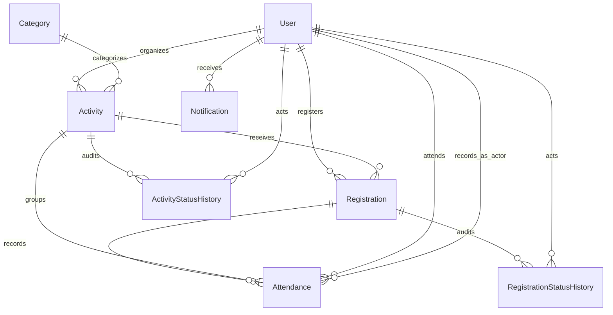

# Backend và database — tuần 8

Candidate hiện tại0648a17 / PR #55 kế thừa PR #52; chưa phải main/production. Nguồn chuẩn: `prisma/schema.prisma`, migrations và `src/lib`. Guest là người chưa đăng nhập, không phải enum Role. [AuthRateLimit và chính sách login/register](week8-auth-protection.md) là cập nhật mới; phần contract cốt lõi bên dưới vẫn áp dụng.

## ERD

IDs là String/cuid, không phải số nguyên. Attendance unique registrationId; Registration unique (userId, activityId); email unique và có index lower(email) từ migration. Mật khẩu chỉ lưu bcrypt, không trả trong API. Enum: Role VOLUNTEER/ORGANIZER/ADMIN; UserStatus ACTIVE/BLOCKED; ActivityStatus DRAFT/PENDING/PUBLISHED/REJECTED/CLOSED; RegistrationStatus PENDING/APPROVED/REJECTED/CANCELLED; AttendanceStatus ATTENDED/ABSENT.

## Quyền và tính toàn vẹn

- API đọc role/status hiện tại từ DB, không tin JWT cũ. Writes cookie phải có Origin cùng ứng dụng. Response thành công `{data}`; lỗi `{error:{code,message}}`, validation có issues. Thành công không cache; lỗi 401/403/404/409/422/500 theo nguyên nhân.
- Chỉ VOLUNTEER đăng ký; quản lý và attendance chỉ Organizer sở hữu hoặc Admin. Public xem PUBLISHED/CLOSED; managed là phạm vi owner hoặc toàn hệ thống của Admin.
- Writes cùng Activity dùng PostgreSQL FOR UPDATE. Capacity đếm APPROVED và kiểm tra sau lock. Unique registration ngăn gửi trùng. Attendance upsert 1 record, ABSENT = 0 giờ, ATTENDED không vượt thời lượng; hủy xóa attendance cùng transaction. Dashboard tính tổng bản ghi ATTENDED, không cộng vào một counter User.
- Notifications tạo trong transaction duyệt; list/read chỉ chủ sở hữu. History lưu actor/from/to/reason. Login/register có rate limiting phân tán qua PostgreSQL tại0648a17; cần cloud verification và review quota theo traffic trước public release.
- Attendance trước giờ bắt đầu, hủy APPROVED, public CLOSED, search description và định nghĩa dashboard còn cần Phúc chốt ở #47. Không tự đổi nghiệp vụ trong bản hardening.

## API thực tế

Mọi `/api` dùng Node runtime. Auth qua NextAuth Credentials, không có bearer API riêng. Không có Server Action nghiệp vụ; UI gọi Route Handlers.

| Method/path | Quyền và contract |
|---|---|
| GET /api/categories | Public; danh sách category |
| GET /api/activities | scope=public/managed; page >=1; q/location/status; meta=1 trả items + pagination 20/page, legacy không filter/meta trả array 50/page |
| POST /api/activities | Organizer/Admin; title<=200, description<=10000, location<=500, dates ISO, capacity 1..100000, categoryId; status DRAFT/PENDING |
| GET /api/activities/:id | Public status hoặc owner/Admin; private trả 404 |
| PATCH /api/activities/:id | Owner/Admin; chỉ DRAFT/REJECTED; ít nhất một field hợp lệ, không owner/status injection |
| DELETE /api/activities/:id | Owner/Admin; chỉ DRAFT/PENDING/REJECTED, không registration history |
| PATCH /api/activities/:id/status | Owner submit/close; Admin publish/reject; status + reason optional <=1000 |
| GET /api/activities/:id/registrations | Owner/Admin; participant data + history, 50/page |
| POST /api/activities/:id/registrations | VOLUNTEER; PUBLISHED, trước startDate, còn capacity, chưa từng đăng ký |
| GET /api/registrations | Signed in; registration của chính actor, 50/page |
| PATCH /api/registrations/:id/status | Owner Volunteer hủy trước start; owner Organizer/Admin duyệt/từ chối PENDING; status + reason |
| GET /api/activities/:id/attendance | Owner/Admin; APPROVED participants, attendance an toàn |
| PUT /api/attendance/:registrationId | Owner/Admin; status ATTENDED/ABSENT, volunteerHours 0..1000 và <=duration |
| GET /api/dashboard/organizer | Organizer scope owner; Admin scope toàn hệ thống |
| GET /api/dashboard/admin | Admin; toàn hệ thống |
| GET /api/notifications | Actor; 20/page, metadata |
| PATCH /api/notifications/:id/read | Chủ notification; isRead=true |
| POST /api/auth/register | Public cùng Origin; name/email/password/confirmPassword/role VOLUNTEER hoặc ORGANIZER; strict schema; xem account-registration.md |
| /api/auth/* | NextAuth handlers, CSRF/session/signin/signout |

## Data Dictionary

Bảng dưới giữ tên/type/default/constraint chính xác từ schema; `?` nullable, `[]` là relation collection. FK và onDelete được ghi trong khai báo relation.

### User

| Field | Type | Constraint / relation |
|---|---|---|
| id | String | @id @default(cuid()) |
| name | String |  |
| email | String | @unique |
| password | String |  |
| role | Role | @default(VOLUNTEER) |
| createdAt | DateTime | @default(now()) |
| updatedAt | DateTime | @updatedAt |
| phone | String? |  |
| avatar | String? |  |
| status | UserStatus | @default(ACTIVE) |
| activities | Activity[] |  |
| registrations | Registration[] |  |
| notifications | Notification[] |  |
| registrationHistory | RegistrationStatusHistory[] |  |
| activityHistory | ActivityStatusHistory[] |  |
| attendance | Attendance[] | @relation("AttendanceUser") |
| attendanceRecorded | Attendance[] | @relation("AttendanceRecordedBy") |

### Category

| Field | Type | Constraint / relation |
|---|---|---|
| id | String | @id @default(cuid()) |
| name | String | @unique |
| description | String? |  |
| createdAt | DateTime | @default(now()) |
| activities | Activity[] |  |

### Activity

| Field | Type | Constraint / relation |
|---|---|---|
| id | String | @id @default(cuid()) |
| title | String |  |
| description | String |  |
| location | String |  |
| startDate | DateTime |  |
| endDate | DateTime |  |
| maxParticipants | Int |  |
| status | ActivityStatus | @default(PENDING) |
| categoryId | String |  |
| organizerId | String |  |
| createdAt | DateTime | @default(now()) |
| updatedAt | DateTime | @updatedAt |
| category | Category | @relation(fields: [categoryId], references: [id], onDelete: Restrict) |
| organizer | User | @relation(fields: [organizerId], references: [id], onDelete: Restrict) |
| registrations | Registration[] |  |
| history | ActivityStatusHistory[] |  |
| attendance | Attendance[] |  |

Index: @@index([status, startDate])

Index: @@index([organizerId])

### Registration

| Field | Type | Constraint / relation |
|---|---|---|
| id | String | @id @default(cuid()) |
| userId | String |  |
| activityId | String |  |
| status | RegistrationStatus | @default(PENDING) |
| registeredAt | DateTime | @default(now()) |
| updatedAt | DateTime | @updatedAt |
| user | User | @relation(fields: [userId], references: [id], onDelete: Restrict) |
| activity | Activity | @relation(fields: [activityId], references: [id], onDelete: Restrict) |
| history | RegistrationStatusHistory[] |  |
| attendance | Attendance? |  |

Index: @@unique([userId, activityId])

Index: @@index([activityId, status])

### RegistrationStatusHistory

| Field | Type | Constraint / relation |
|---|---|---|
| id | String | @id @default(cuid()) |
| registrationId | String |  |
| actorId | String |  |
| fromStatus | RegistrationStatus? |  |
| toStatus | RegistrationStatus |  |
| reason | String? |  |
| createdAt | DateTime | @default(now()) |
| registration | Registration | @relation(fields: [registrationId], references: [id], onDelete: Restrict) |
| actor | User | @relation(fields: [actorId], references: [id], onDelete: Restrict) |

Index: @@index([registrationId, createdAt])

### ActivityStatusHistory

| Field | Type | Constraint / relation |
|---|---|---|
| id | String | @id @default(cuid()) |
| activityId | String |  |
| actorId | String |  |
| fromStatus | ActivityStatus? |  |
| toStatus | ActivityStatus |  |
| reason | String? |  |
| createdAt | DateTime | @default(now()) |
| activity | Activity | @relation(fields: [activityId], references: [id], onDelete: Cascade) |
| actor | User | @relation(fields: [actorId], references: [id], onDelete: Restrict) |

Index: @@index([activityId, createdAt])

### Attendance

| Field | Type | Constraint / relation |
|---|---|---|
| id | String | @id @default(cuid()) |
| registrationId | String | @unique |
| activityId | String |  |
| userId | String |  |
| status | AttendanceStatus |  |
| volunteerHours | Decimal | @default(0) @db.Decimal(6, 2) |
| recordedById | String |  |
| createdAt | DateTime | @default(now()) |
| updatedAt | DateTime | @updatedAt |
| registration | Registration | @relation(fields: [registrationId], references: [id], onDelete: Cascade) |
| activity | Activity | @relation(fields: [activityId], references: [id], onDelete: Cascade) |
| user | User | @relation("AttendanceUser", fields: [userId], references: [id], onDelete: Restrict) |
| recordedBy | User | @relation("AttendanceRecordedBy", fields: [recordedById], references: [id], onDelete: Restrict) |

Index: @@index([activityId, status])

Index: @@index([userId, status])

### Notification

| Field | Type | Constraint / relation |
|---|---|---|
| id | String | @id @default(cuid()) |
| userId | String |  |
| title | String |  |
| message | String |  |
| isRead | Boolean | @default(false) |
| createdAt | DateTime | @default(now()) |
| user | User | @relation(fields: [userId], references: [id], onDelete: Cascade) |

Index: @@index([userId, isRead])
